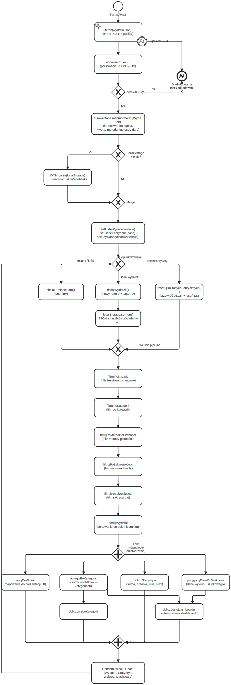
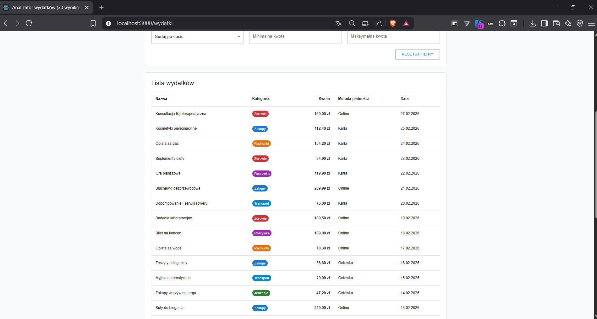
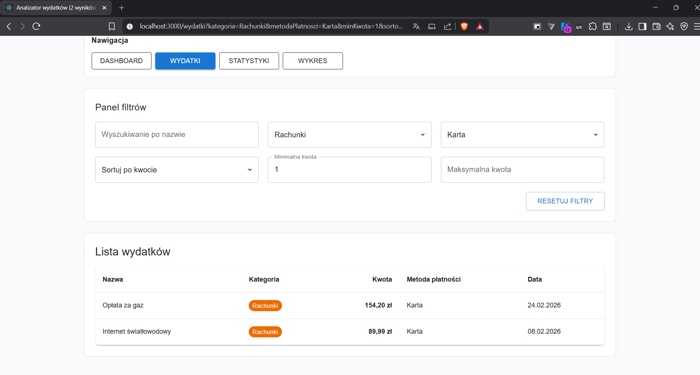
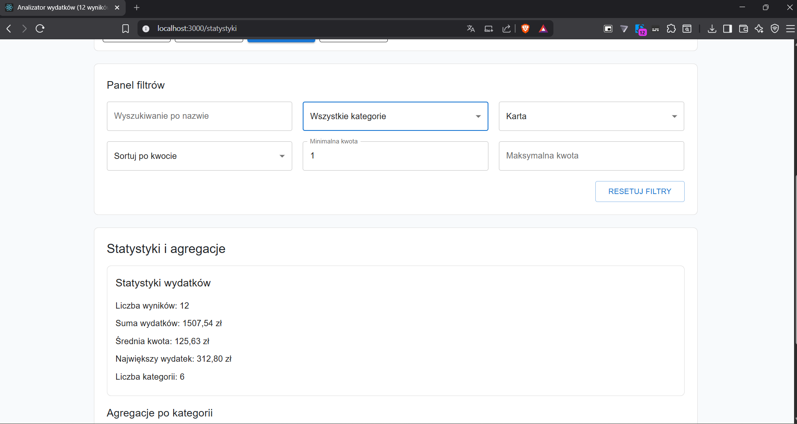
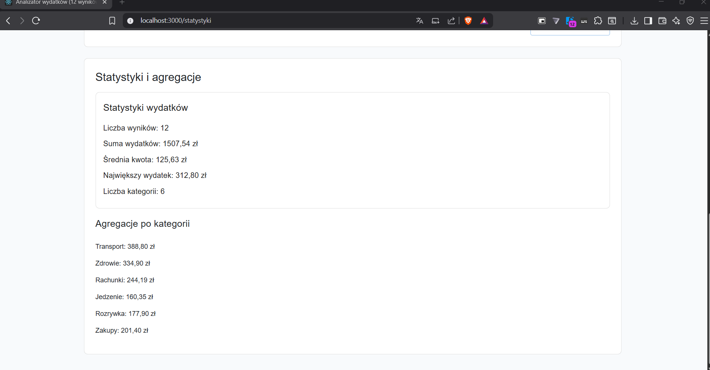
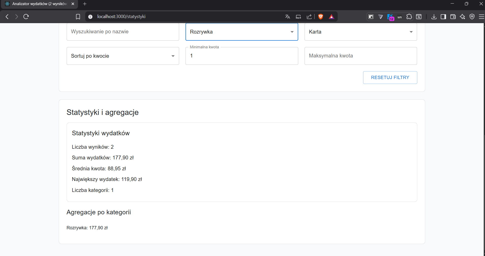
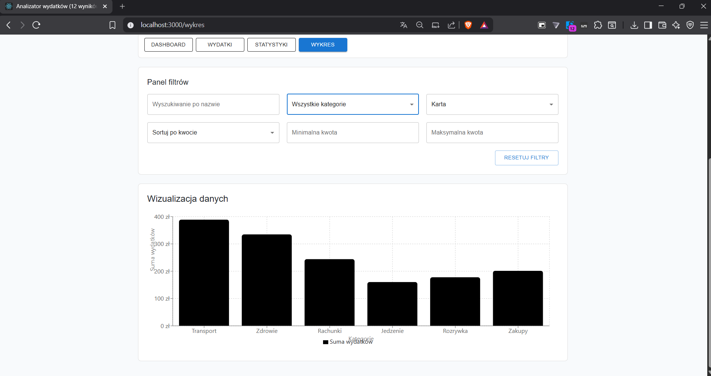
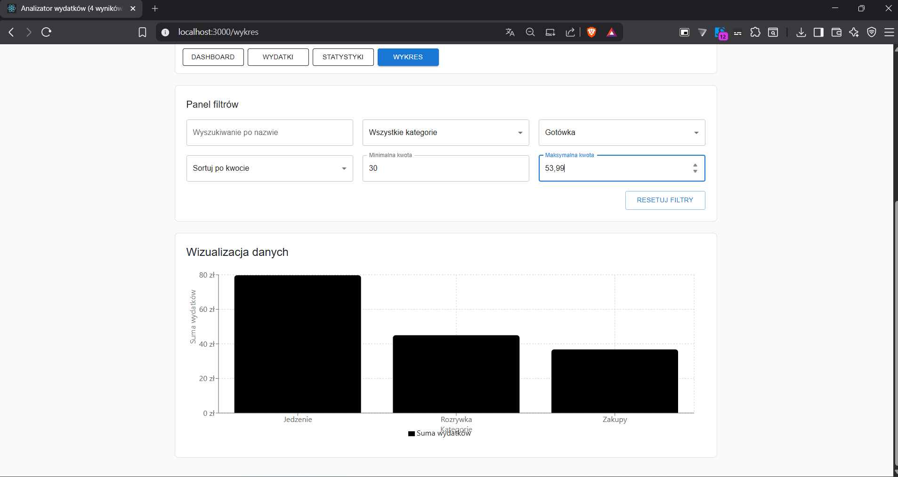
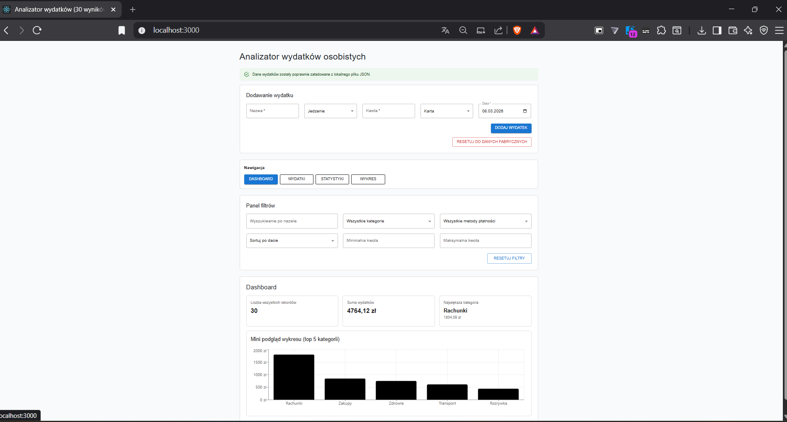
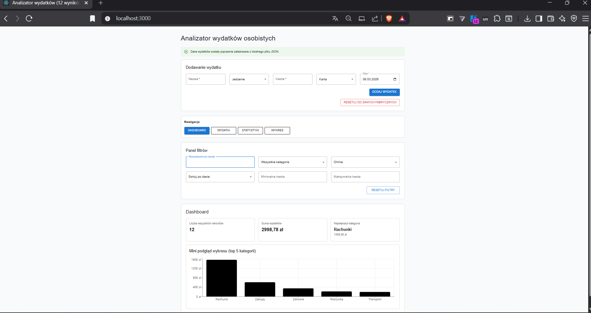

# Autor:
Adam Sieheń

Nr albumu: 38242

WSB Merito Gdańsk

Przedmiot: Programowanie funkcyjne w ramach różnic programowych

# Analizator wydatków osobistych — Zadanie 2

Aplikacja React, w której **logika przetwarzania danych jest realizowana w czystych funkcjach** zgodnie z zasadami programowania funkcyjnego, natomiast React pełni rolę **shell'a** zarządzającego stanem, routingiem i interakcją z użytkownikiem.

Autor: Adam Sieheń

---

## Realizacja wymagań z polecenia (1–10)

### 1. Źródło danych — plik JSON pobierany asynchronicznie

Dane wydatków znajdują się w pliku `public/wydatki.json`. Po uruchomieniu aplikacji `App.jsx` pobiera je asynchronicznie przez `fetch()` z użyciem `AbortController` (obsługa anulowania). Następnie dane są:
- parsowane (`response.json()`),
- walidowane (sprawdzenie czy wynik jest tablicą),
- normalizowane funkcją `normalizujWydatek` (uzupełnianie brakujących pól, rzutowanie typów),
- opcjonalnie scalane z danymi użytkownika zapisanymi w `localStorage`.

### 2. Pipeline funkcyjny (12 czystych funkcji)

Plik `src/utils/pipelineWydatkow.js` zawiera pipeline złożony z **12 eksportowanych czystych funkcji**. Żadna z nich nie modyfikuje danych wejściowych — każda zwraca nową tablicę lub obiekt.

**Sekwencja kroków pipeline (`uruchomPipelineWydatkow`):**

| Krok | Funkcja | Rola |
|------|---------|------|
| 1 | `filtrujPoNazwie` | Filtrowanie po fragmencie nazwy (case-insensitive) |
| 2 | `filtrujPoKategorii` | Filtrowanie po kategorii |
| 3 | `filtrujPoMetodziePlatnosci` | Filtrowanie po metodzie płatności |
| 4 | `filtrujPoZakresieKwot` | Filtrowanie po zakresie kwot (min/max) |
| 5 | `filtrujPoZakresieDat` | Filtrowanie po zakresie dat |
| 6 | `sortujWydatki` | Sortowanie po wybranym polu i kierunku |
| 7 | `mapujDoWidoku` | Mapowanie na format prezentacyjny |
| 8 | `agregujPoKategorii` | Agregacja sum w podziale na kategorie (reduce) |
| 9 | `obliczStatystyki` | Statystyki: suma, średnia, min, max, liczba pozycji |
| 10 | `przygotujDaneDoWykresu` | Dane do wykresu słupkowego (reduce → map) |
| 11 | `obliczLiczbeKategorii` / `obliczNajwiekszaKategorie` | Metryki kategorii |
| 12 | `obliczDaneDashboardu` | Kompozycja danych dashboardu z wyników kroków 8–11 |

Każda funkcja jest **czysta**: przyjmuje dane, zwraca nowy wynik, nie powoduje efektów ubocznych.

### 3. Dynamiczne filtry

Komponent `PanelFiltrow` (`src/MyComponents/AnalizatorWydatkow/PanelFiltrow.js`) udostępnia 6 filtrów:

| Filtr | Typ kontrolki | Parametr URL |
|-------|---------------|--------------|
| Wyszukiwanie po nazwie | TextField | `nazwa` |
| Kategoria | Select (Wszystkie / Jedzenie / Transport / …) | `kategoria` |
| Metoda płatności | Select (Wszystkie / Karta / Gotówka / Online) | `metodaPlatnosci` |
| Minimalna kwota | TextField (number) | `minKwota` |
| Maksymalna kwota | TextField (number) | `maxKwota` |
| Sortowanie | Select (data / kwota / nazwa) | `sortowanie` |

Zmiana dowolnego filtra powoduje automatyczne przeliczenie pipeline przez `useMemo`.
Przycisk **Resetuj filtry** przywraca wartości domyślne (`FILTRY_POCZATKOWE`).

### 4. Podział na komponenty

Aplikacja składa się z następujących komponentów:

| Komponent | Plik | Rola |
|-----------|------|------|
| **Filters** | `PanelFiltrow.js` | Panel filtrów i sortowania |
| **Results** | `WynikiWydatkow.jsx` | Tabela wyników (lista wydatków) |
| **Stats** | `StatystykiWydatkow.jsx` | Statystyki (suma, średnia, min, max, kategorie) |
| **Chart** | `WykresWydatkow.jsx` | Wykres słupkowy (Recharts) |
| Dashboard | `Dashboard.jsx` | Podsumowanie z mini-wykresem |
| Nawigacja | `Nawigacja.jsx` | Pasek nawigacji (linki do widoków) |
| Dodawanie wydatku | `PanelDodawaniaWydatku.js` | Formularz dodawania nowego wydatku |

### 5. Komunikacja między komponentami — propsy i callbacki

`App.jsx` (shell) zarządza całym stanem aplikacji i przekazuje go w dół drzewa komponentów:

- **Props w dół:** `App` → widoki (`WidokWydatki`, `WidokStatystyki`, …) → komponenty prezentacyjne — dane do wyświetlenia (`wydatki`, `statystyki`, `daneWykresu`, `filtry`, `kategorie`, `metodyPlatnosci`).
- **Callbacki w górę:** komponenty powiadamiają `App` o akcjach użytkownika:
  - `onZmianaFiltru(nazwaPola, wartosc)` — zmiana jednego pola filtra,
  - `onResetujFiltry()` — przywrócenie filtrów domyślnych,
  - `onDodajWydatek(nowyWydatek)` — dodanie nowego wydatku do listy,
  - `onResetujFabryczne()` — przywrócenie danych fabrycznych z JSON.

### 6. Routing — React Router v6

Konfiguracja tras znajduje się w `src/routing/konfiguracjaTras.js`:

| Ścieżka | Widok | Opis |
|---------|-------|------|
| `/` | `WidokDashboard` | Strona główna z podsumowaniem |
| `/wydatki` | `WidokWydatki` | Lista wydatków z filtrami |
| `/kategoria/:kategoria` | `WidokWydatki` | Wydatki z predefiniowaną kategorią z URL |
| `/statystyki` | `WidokStatystyki` | Panel statystyk |
| `/wykres` | `WidokWykres` | Wykres wydatków |

**Synchronizacja filtrów z URL** — komponent `SynchronizacjaFiltrowURL` zapewnia dwukierunkową synchronizację:
- **URL → State:** po wejściu na np. `/wydatki?kategoria=Rozrywka&minKwota=30` filtry ustawiają się automatycznie.
- **State → URL:** zmiana filtra w UI natychmiast aktualizuje query string, np. `/wydatki?kategoria=Jedzenie&metodaPlatnosci=Karta&sortowanie=kwotaMalejaco`.
- Wartości domyślne (np. „Wszystkie", puste teksty) nie pojawiają się w URL — URL jest czytelny.
- Nawigacja na `/kategoria/Rozrywka` automatycznie ustawia filtr kategorii.

### 7. Hooki React

| Hook | Użycie w `App.jsx` |
|------|---------------------|
| `useState` | Stan wydatków (`listaWydatkow`), filtrów (`filtry`), ładowania (`czyLadowanie`), błędu (`bladLadowania`), danych fabrycznych (`daneFabryczne`) |
| `useEffect` | Pobieranie danych z JSON (z `AbortController`), zapis do `localStorage`, synchronizacja URL ↔ filtrów (3 efekty w `SynchronizacjaFiltrowURL`) |
| `useMemo` | Wywołanie `uruchomPipelineWydatkow` — pipeline przelicza się **wyłącznie** gdy zmienią się dane lub filtry. Również: `dostepneKategorie` i `dostepneMetodyPlatnosci` |
| `useCallback` | Stabilne referencje callbacków: `obsluzZmianeFiltru`, `ustawFiltryZUrl`, `obsluzDodanieWydatku`, `obsluzResetFiltrow`, `przywrocDaneFabryczne` |
| `useRef` | Zapobieganie nieskończonej pętli URL ↔ State (referencja `filtryRef` + flaga `pierwszyRender`) |
| `useLocation`, `useMatch`, `useSearchParams` | Odczyt i zapis parametrów URL (React Router) |

### 8. Wykres aktualizowany dynamicznie

Komponent `WykresWydatkow` renderuje wykres słupkowy za pomocą biblioteki **Recharts**. Dane do wykresu (`daneWykresu`) są obliczane przez czystą funkcję `przygotujDaneDoWykresu` w ramach pipeline — każda zmiana filtrów lub sortowania powoduje przeliczenie `useMemo` i automatyczną aktualizację wykresu.

### 9. Czytelny i interaktywny interfejs

- Biblioteka komponentów: **Material UI** (`@mui/material`).
- Wyniki wyświetlane w tabeli (`WynikiWydatkow`) z kolumnami: Nazwa, Kategoria, Kwota, Metoda płatności, Data.
- Kategorie wyróżnione kolorowym chipem.
- Filtry reagują na zmiany użytkownika w czasie rzeczywistym — bez przycisku „Szukaj".
- Parametry URL odzwierciedlają aktualny stan filtrów — można kopiować / udostępniać link z konkretnymi filtrami.
- Responsywna nawigacja między widokami (Dashboard, Wydatki, Statystyki, Wykres).

---

## Architektura: React jako shell + logika funkcyjna

```
┌─────────────────────────────────────────────────────────┐
│                    App.jsx (SHELL)                      │
│  useState / useEffect / useCallback / useRef            │
│  Routing (BrowserRouter, Routes, SynchronizacjaFiltrow) │
│  fetch() → localStorage → setListaWydatkow              │
├─────────────────────────────────────────────────────────┤
│                useMemo ──▶ Pipeline					 |
│                                                         │
│   dane + filtry ──▶ uruchomPipelineWydatkow() ──▶ wynik│
├─────────────────────────────────────────────────────────┤
│          Komponenty prezentacyjne (props only)          │
│  PanelFiltrow │ WynikiWydatkow │ Statystyki │ Wykres    │
└─────────────────────────────────────────────────────────┘
```

- **Shell (`App.jsx`)** — zarządza stanem, routingiem, efektami ubocznymi (fetch, localStorage, URL).
- **Logika funkcyjna (`pipelineWydatkow.js`)** — 12 czystych funkcji, zero efektów ubocznych, łatwe do testowania i komponowania.
- **Komponenty widokowe** — otrzymują gotowe dane przez propsy i renderują wynik; nie zawierają logiki biznesowej.

### Dlaczego programowanie funkcyjne jest rdzeniem logiki?

1. **Deterministyczność** — przy tych samych danych i filtrach pipeline zawsze zwróci ten sam wynik. Ułatwia to testowanie i debugowanie.
2. **Niemutowalność** — każda funkcja tworzy nowe struktury zamiast modyfikować istniejące. Eliminuje to błędy związane z nieoczekiwanymi mutacjami stanu.
3. **Kompozycja** — pipeline to sekwencja prostych funkcji składanych w łańcuch (`krok1 → krok2 → … → krok12`). Łatwo dodać lub usunąć krok bez wpływu na resztę.
4. **Separacja warstw** — czyste funkcje nie wiedzą nic o React, DOM czy URL. React pełni rolę shell'a, który dostarcza dane do pipeline i wyświetla wyniki.
5. **Optymalizacja** — dzięki czystości funkcji React może bezpiecznie cache'ować wyniki przez `useMemo`, przeliczając pipeline tylko wtedy, gdy zmienią się dane wejściowe.

---

## Pipeline — przepływ danych

```
Wejście: dane (JSON) + filtry (stan React)
    │
    ├─▶ filtrujPoNazwie
    ├─▶ filtrujPoKategorii
    ├─▶ filtrujPoMetodziePlatnosci
    ├─▶ filtrujPoZakresieKwot
    ├─▶ filtrujPoZakresieDat
    ├─▶ sortujWydatki
    │
    ├─▶ mapujDoWidoku ──────────▶ wydatkiDoWidoku (tabela)
    ├─▶ agregujPoKategorii ─────▶ agregatyKategorii
    ├─▶ obliczStatystyki ───────▶ statystyki
    ├─▶ przygotujDaneDoWykresu ─▶ daneWykresu (wykres)
    └─▶ obliczDaneDashboardu ───▶ dashboard
```

### Diagram BPMN pipeline'a



Diagram przedstawia pełny przepływ danych w 5 fazach:
1. **Ładowanie JSON** — `fetch(wydatki.json)` → parsowanie → walidacja → normalizacja,
2. **Merge z localStorage** — sprawdzenie czy istnieją zapisane dane użytkownika,
3. **Interakcja użytkownika** — zmiana filtrów / dodanie wydatku / reset fabryczny,
4. **Pipeline funkcyjny** — sekwencyjne filtrowanie i sortowanie, następnie równoległe obliczenia (mapowanie, agregacja, statystyki, dane wykresu, dashboard),
5. **Renderowanie UI** — wyświetlenie wyników w widokach React z pętlą zwrotną do akcji użytkownika.

Źródło: [`pipeline-wydatkow.bpmn`](pipeline-wydatkow.bpmn) (edytowalny w bpmn.io).

---

## Struktura projektu

```
myapp/
├── public/
│   └── wydatki.json                  ← dane wejściowe (JSON)
├── src/
│   ├── App.jsx                       ← shell (stan, routing, efekty)
│   ├── App.css                       ← style
│   ├── utils/
│   │   ├── pipelineWydatkow.js       ← 12 czystych funkcji pipeline
│   │   └── funkcjeWydatkow.js        ← dodatkowe funkcje pomocnicze
│   ├── MyComponents/
│   │   ├── Nawigacja.jsx             ← pasek nawigacji
│   │   ├── Dashboard.jsx             ← widok dashboardu
│   │   ├── WynikiWydatkow.jsx        ← tabela wyników
│   │   ├── StatystykiWydatkow.jsx    ← panel statystyk
│   │   ├── WykresWydatkow.jsx        ← wykres (Recharts)
│   │   └── AnalizatorWydatkow/
│   │       ├── PanelFiltrow.js       ← filtry i sortowanie
│   │       └── PanelDodawaniaWydatku.js ← formularz dodawania
│   ├── widoki/
│   │   ├── WidokDashboard.jsx
│   │   ├── WidokWydatki.jsx
│   │   ├── WidokStatystyki.jsx
│   │   └── WidokWykres.jsx
│   └── routing/
│       └── konfiguracjaTras.js       ← konfiguracja React Router
└── package.json
```

## Uruchomienie

```bash
cd myapp
npm install
npm start
```

Aplikacja uruchomi się pod adresem `http://localhost:3000`.

---

## Zrzuty ekranu

**Tabela wyników przed filtrowaniem:**

**Tabela wyników po filtrowaniu:**


**Panel statystyk:**




**Wykres wydatków:**



**Dashboard:**


